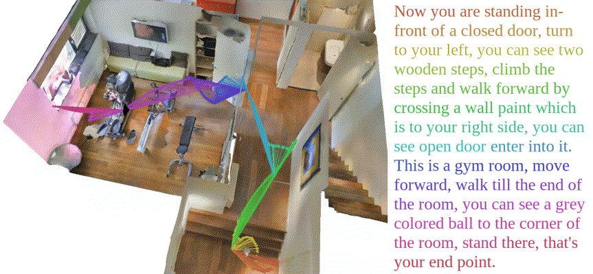

# Room-Across-Room (RxR) Dataset

Room-Across-Room (RxR) is a multilingual dataset for
[Vision-and-Language Navigation](https://arxiv.org/abs/1711.07280) (VLN) for
[Matterport3D](https://niessner.github.io/Matterport/) environments. In contrast
to related datasets such as [Room-to-Room](https://bringmeaspoon.org/) (R2R),
RxR is 10x larger, multilingual (English, Hindi and Telugu), with longer and
more variable paths, and it includes and fine-grained visual groundings that
relate each word to pixels/surfaces in the environment.



RxR is released as gzipped [JSON Lines](https://jsonlines.org/) and
[numpy archives](https://numpy.org/doc/stable/reference/generated/numpy.savez.html),
and has four components: guide annotations, follower annotations, pose traces,
and text features. The guide annotations alone are akin to R2R and sufficient to
run the standard VLN setup.

### Reference

The RxR dataset is described in [Room-Across-Room: Multilingual
Vision-and-Language Navigation with Dense Spatiotemporal
Grounding](https://arxiv.org/abs/2010.07954).

Bibtex:

```
@inproceedings{rxr,
  title={{Room-Across-Room}: Multilingual Vision-and-Language Navigation with Dense Spatiotemporal Grounding},
  author={Alexander Ku and Peter Anderson and Roma Patel and Eugene Ie and Jason Baldridge},
  booktitle={Conference on Empirical Methods for Natural Language Processing (EMNLP)},
  year={2020}
}
```

## Dataset Download

To download the full 161GB dataset (guide annotations, follower annotations,
pose traces, and text features), install the
[gsutil](https://cloud.google.com/storage/docs/gsutil_install#install) tool and
run:

```bash
gsutil -m cp -R gs://rxr-data .
```

Using `-m` gsutil downloads using multi-threading and multi-processing, using a
number of threads and processors determined by the `parallel_thread_count` and
`parallel_process_count` values set in the boto configuration file. You might
want to experiment with these values for the fastest download.

Alternatively, see the instructions below for downloading separate components of
the dataset.

### Downloading Guide Annotations

Each JSON Lines entry contains a guide annotation for a path in the environment.

Data schema:

```python
{'split': str,
 'instruction_id': int,
 'annotator_id': int,
 'language': str,
 'path_id': int,
 'scan': str,
 'path': Sequence[str],
 'heading': float,
 'instruction': str,
 'timed_instruction': Sequence[Mapping[str, Union[str, float]]],
 'edit_distance': float}
```

Field descriptions:

*   `split`: The annotation split: `train`, `val_seen`, `val_unseen`,
    `test_standard`.
*   `instruction_id`: Uniquely identifies the guide annotation.
*   `annotator_id`: Uniquely identifies the guide annotator.
*   `language`: The IETF BCP 47 language tag: `en-IN`, `en-US`, `hi-IN`,
    `te-IN`.
*   `path_id`: Uniquely identifies a path sampled from the Matterport3D
    environment.
*   `scan`: Uniquely identifies a scan in the Matterport3D environment.
*   `path`: A sequence of panoramic viewpoints along the path.
*   `heading`: The initial heading in radians. Following R2R, the heading angle
    is zero facing the y-axis with z-up, and increases by turning right.
*   `instruction`: The navigation instruction.
*   `timed_instruction`: A sequence of time-aligned words in the instruction.
    Note that a small number of words are missing the `start_time` and
    `end_time` fields.
    *   `word`: The aligned utterance.
    *   `start_time`: The start of the time span, w.r.t. the recording.
    *   `end_time`: The end of the time span, w.r.t. the recording.
*   `edit_distance` Edit distance between the manually transcribed instructions
    and the automatic transcript generated by Google Cloud
    [Text-to-Speech](https://cloud.google.com/text-to-speech) API.

Sample entry:

```python
{'path_id': 11,
 'split': 'val_seen',
 'scan': '2n8kARJN3HM',
 'heading': 3.105381634905035,
 'path': ['d38a4c31821c48ac9082d896e628c128',
  '1d6a100cf3d34326936ef7d0a50840d9',
  '87998608d4844fcfaca266bd5aba6516',
  '5248918af65645a28a65f59d3424598a',
  'e0b2917ecb6d4e31846957451348f80a'],
 'instruction_id': 26,
 'annotator_id': 19,
 'language': 'en-IN',
 'instruction': 'Okay, now you are in a room facing towards two bathtubs, one on the right side ...',
 'timed_instruction': [{'start_time': 0.4, 'word': 'Okay,', 'end_time': 1.0}, ...],
 'edit_distance': 0.11137440758293839}
```

Guide annotations can be downloaded from these links:

*   [`rxr_train_guide` (72.1M)](https://storage.cloud.google.com/rxr-data/rxr_train_guide.jsonl.gz)
*   [`rxr_val_seen_guide` (12.9M)](https://storage.cloud.google.com/rxr-data/rxr_val_seen_guide.jsonl.gz)
*   [`rxr_val_unseen_guide` (12M)](https://storage.cloud.google.com/rxr-data/rxr_val_unseen_guide.jsonl.gz)
*   [`rxr_test_standard` (1.9M)](https://storage.cloud.google.com/rxr-data/rxr_test_standard_public_guide.jsonl.gz) -
    used for the
    [RxR competition](https://ai.google.com/research/rxr/competition?active_tab=leaderboard)
*   [`rxr_test_challenge` (1.9M)](https://storage.cloud.google.com/rxr-data/rxr_test_challenge_public_guide.jsonl.gz) -
    used for the
    [RxR-Habitat competition](https://ai.google.com/research/rxr/habitat?active_tab=leaderboard)

### Downloading Follower Annotations

Each JSON Lines entry contains a follower annotation for an instruction in the
guide annotations.

Data schema:

```python
{'demonstration_id': int,
 'instruction_id': int,
 'annotator_id': int,
 'path': Sequence[str],
 'metrics': {'ne': float,
  'sr': float,
  'spl': float,
  'dtw': float,
  'ndtw': float,
  'sdtw': float}}
```

Field descriptions:

*   `demonstration_id`: Uniquely identifies the follower annotation.
*   `instruction_id`: Uniquely identifies the guide annotation being followed.
*   `annotator_id`: Uniquely identifies the follower annotator.
*   `path`: A sequence of panoramic viewpoint along the path traversed by the
    follower (which may differ to the guide path).
*   `metrics`: Evaluation metrics for the follower path measured against the
    guide path:
    *   `ne`: Navigation Error, the shortest-path distance between the final
        viewpoint in each path.
    *   `sr`: Success Rate, whether `ne` is less than 3 meters.
    *   `spl`
        [Success weighted by Path Length](https://arxiv.org/abs/1807.06757),
        success weighted by traversal efficiency.
    *   `dtw` [Dynamic Time Warping](https://arxiv.org/abs/1907.05446) (DTW)
        cost, the divergence between guide and follower paths.
    *   `ndtw` Normalized DTW cost.
    *   `sdtw` Success-weighted normalized DTW cost.

Sample entry:

```python
{'demonstration_id': 26,
 'instruction_id': 26,
 'annotator_id': 43,
 'path': ['d38a4c31821c48ac9082d896e628c128',
  '1d6a100cf3d34326936ef7d0a50840d9',
  'd8eb4eab2d3442e1a3a7a74fc810be22',
  '87998608d4844fcfaca266bd5aba6516',
  '5248918af65645a28a65f59d3424598a',
  'e0b2917ecb6d4e31846957451348f80a'],
 'metrics': {'ne': 0,
  'sr': 1.0,
  'spl': 0.9479355350139731,
  'dtw': 1.5461700564297585,
  'ndtw': 0.9020566069282614,
  'sdtw': 0.9020566069282614}}
```

Follower annotations can be downloaded from these links:

*   [`rxr_train_follower` (12.8M)](https://storage.cloud.google.com/rxr-data/rxr_train_follower.jsonl.gz)
*   [`rxr_val_seen_follower` (1.4M)](https://storage.cloud.google.com/rxr-data/rxr_val_seen_follower.jsonl.gz)
*   [`rxr_val_unseen_follower` (1.6M)](https://storage.cloud.google.com/rxr-data/rxr_val_unseen_follower.jsonl.gz)

## Extended Dataset

The extended RxR dataset is substantially larger and comprised of many small
files. Therefore, we recommend installing the
[gsutil](https://cloud.google.com/storage/docs/gsutil_install#install) tool to
copy the dataset in parallel. Individual download via URL is also an option.

### Downloading Pose Traces

Guide and follower annotations are paired with their corresponding pose traces:
a sequence of snapshots that capture the annotator's virtual camera pose and
field-of-view. The naming convention for these files is
`{instruction_id:06}_guide_pose_trace.npz` for guide annotations and
`{demonstration_id:06}_follower_pose_trace.npz` for follower annotations.

Data schema:

```python
{'pano': (np.str, [n, 1]),
 'time': (np.float32, [n, 1]),
 'audio_time': (np.float32, [n, 1]),
 'extrinsic_matrix': (np.float32, [n, 16]),
 'intrinsic_matrix': (np.float32, [n, 16]),
 'image_mask': (np.bool, [k, 128, 256]),
 'text_masks': (np.bool, [k, m]),
 'feature_weights': (np.float32, [k, 36])}
```

Where `n` is the number of snapshots, `k` is the number of panoramic viewpoints
in the associated path, and `m` is the number of BERT SubWord in the tokenized
instructions.

Field descriptions:

*   `pano`: Panoramic viewpoint of the snapshot.
*   `time`: Timestamp of the snapshot in seconds.
*   `audio_time`: Timestamp corresponding to the follower's progress listening
    to the guide's instruction recording. This is only included in follower pose
    traces.
*   `extrinsic_matrix`: The
    [extrinsic parameters](https://en.wikipedia.org/wiki/Camera_resectioning),
    or [pose](https://en.wikipedia.org/wiki/Pose_\(computer_vision\)), of the
    annotator's camera.
*   `intrinsic_matrix`: The
    [intrinsic parameters](https://en.wikipedia.org/wiki/Camera_resectioning),
    or
    [projection matrix](https://en.wikipedia.org/wiki/3D_projection#Perspective_projection),
    of the annotator's camera.
*   `image_mask`: Mask indicating the pixels observed in the panorama. This mask
    is in equirectangular format, with heading angle 0 being the center of the
    image.
*   `text_masks`: Mask indicating the utterances that have been spoken or heard
    by the guide or follower, respectively, at this panoramic viewpoint.
*   `feature_weights`: An `image_mask` in feature space, corresponding to the
    typical setting in which 36 image features are generated at 12 heading and 3
    elevation increments. Each value is a mean-pooled perspective projection of
    the `image_mask` for a particular heading and elevation.

Note that `image_mask`, `text_mask`, and `feature_weights` are provided solely
for convenience, as they can be generated from the other pose trace fields and
the `timed_instruction`.

Download command (downloads 18.6GB):

```bash
gsutil -m cp -R gs://rxr-data/pose_traces .
```

Individual pose traces can be downloaded via URL: *
`https://storage.cloud.google.com/rxr-data/pose_traces/{split}/{instruction_id:06}_guide_pose_trace.npz`
*
`https://storage.cloud.google.com/rxr-data/pose_traces/{split}/{demonstration_id:06}_follower_pose_trace.npz`

Where `split` is one of `rxr_train`, `rxr_val_seen`, `rxr_val_unseen`.

### Downloading BERT Text Features

[Multilingual Cased BERT](https://tfhub.dev/tensorflow/bert_multi_cased_L-12_H-768_A-12/2)
features for the instructions, and cross-translations thereof, are provided
solely for convenience. Cross-translations (e.g., `en` -> `hi`, `te`) are
generated via the Google Cloud
[Translation](https://cloud.google.com/translate/) API and are included as well.

Data schema:

```python
{'tokens': (np.str, [m, 1]), 'features': (np.float32, [m, 768])}
```

Where `m` is the number of BERT SubWord in the tokenized instructions.

Field descriptions:

*   `tokens`: Sequence of BERT SubWord tokens.
*   `features`: Features extracted from the last layer of the BERT encoder.

Download command (downloads 142.5GB):

```bash
gsutil -m cp -R gs://rxr-data/text_features .
```

Individual text features can be downloaded via URL: *
`https://storage.cloud.google.com/rxr-data/pose_traces/{split}/{instruction_id:06}_{language}_text_features.npz`

Where `split` is one of: `rxr_train`, `rxr_val_seen`, `rxr_val_unseen`; and
`language` is one of: `en`, `hi`, `te`.

## Visualizations

To visualize examples of RxR instructions and pose traces, code is provided in
the [visualizations](visualizations/README.md) subdirectory.

## Test Server and Leaderboard

To benchmark progress on the dataset, we have launched two competitions with
public leaderboards. See the links for details:

- [RxR competition](https://ai.google.com/research/rxr/)
- [RxR-Habitat competition](https://ai.google.com/research/rxr/habitat)

## Changelog

-   **2021-05-24**: Updated 7 corrupted `guide_pose_trace.npz` files in `rxr_train`
    (with instruction ids 105606, 31170, 39104, 63599, 102712, 83073,
    110502).

## Contact us

If you have a technical question regarding the dataset or publication, please
create an issue in this repository. This is the fastest way to reach us.

If you would like to share feedback or report concerns, please email us at
rxrvln@google.com.

## License

The Matterport3D dataset is governed by the
[Matterport3D Terms of Use](http://kaldir.vc.in.tum.de/matterport/MP_TOS.pdf).
RxR annotations are released under the CC-BY license.
